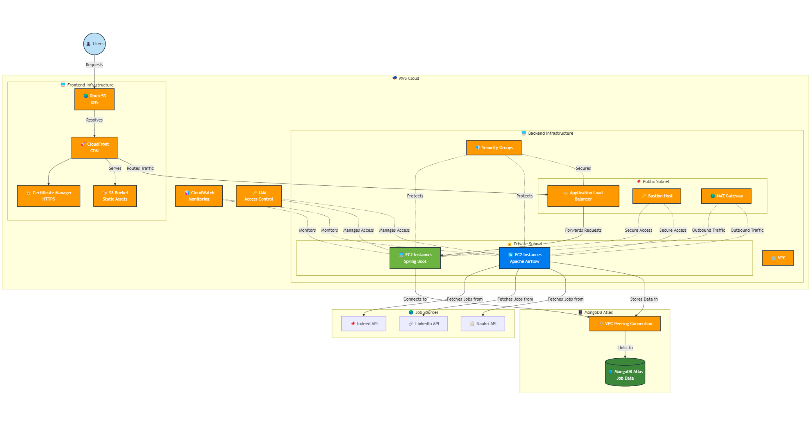

# JobSeeker - Job Aggregation Platform

# Overview

JobSeeker is a comprehensive job aggregation platform that collects and presents job listings from major job boards including Indeed, 
LinkedIn, and Naukri. The platform features an automated web crawler to gather job data and a user-friendly interface to search and 
browse job listings.

# Architecture

## System Components

### Web Crawler Service

- Automated web crawler using Apache Airflow for workflow orchestration
- Scrapes job data from Indeed, LinkedIn, and Naukri
- Stores collected data in MongoDB

### Backend Service

- Java Spring Boot microservice architecture
- User authentication and authorization
- Job search API with filtering capabilities
- Paginated data retrieval for optimal performance

### Frontend Application

- Developed with Angular 18
- Responsive design for all device types
- Interactive job search and filtering interface

# AWS Infrastructure

The application is deployed on AWS with the following components:

### Frontend Deployment

- CloudFront for content delivery
- Route53 for DNS management
- Certificate Manager for HTTPS
- S3 for static asset storage

### Backend Deployment

- VPC with public and private subnets
- Application Load Balancer (ALB) in public subnet
- EC2 instances in private subnet running Spring Boot
- Security Groups for network access control

### Database

- MongoDB Atlas for job data storage
- VPC Peering between AWS and MongoDB Atlas

### Workflow Orchestration

- Apache Airflow running on EC2 instances in private subnet
- Scheduled job scraping tasks
- Error handling and retry mechanisms

### Security & Monitoring

- Bastion Host for secure administrative access
- NAT Gateway for outbound internet access from private subnets
- CloudWatch for monitoring and alerts
- IAM for access control

